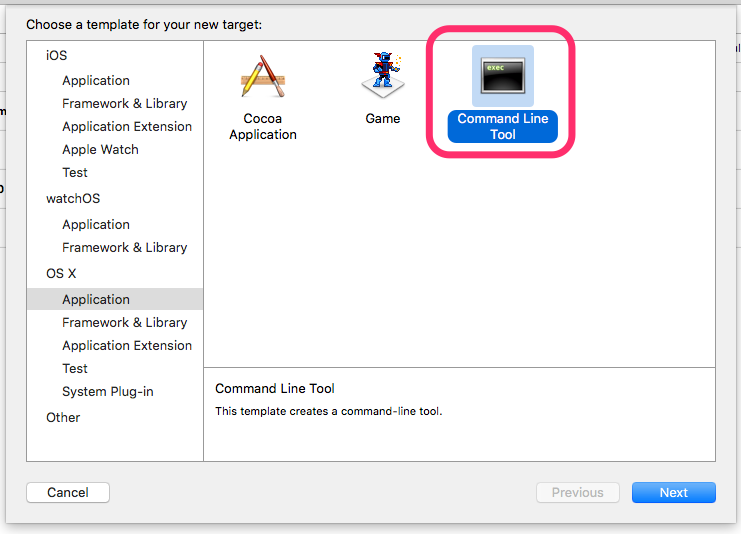
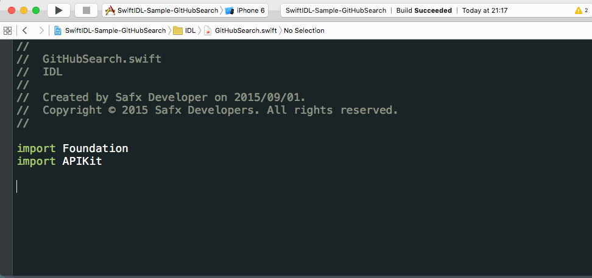

# Swift-IDL

Swift-IDL generates Swift source from Swift source.

Swift-IDL can generate Swift source code adding some functionality from inherited *peseudo* protocols as follows:

* JSONEncodable
* JSONDecodable
* ClassInit
* Printable (generates `CustomStringConvertible`)
* URLRequestHelper
* APIKitHelper (for [APIKit](https://github.com/ishkawa/APIKit))
* EJDB
* EnumStaticInit (WIP, maybe dropped)
* NSCoding (WIP, maybe dropped)

All available protocols are declared in IDLProtocols.swift.

## Requirements

* mako (`pip install mako`)
* SourceKitten (Use `brew install SourceKitten`)
* Xcode 7 (Set as default to use `xcode-select -s`)

## Up and Running

1. Create target, e.g., "IDL", which can omit some options in command line later, by choosing "Command Line Tool" to your project in Xcode.
        
1. Add scheme, e.g., "IDL". If you add target in Xcode, this step could be skipped.
1. Add Empty Swift file, which add target to "IDL"
1. `python swift-idl.py -o Source/gen YourProject.xcodeproj -f`
1. Add the output files to your project.
1. Add the additional Swift files from protocol directory, which depends on protocols you chosen. For example, add `JSONDecodable.swift` to your project, if you use `JSONDecodable`.

## Usage

`swift-idl.py --help` will show the usage text.

```sh
usage: swift-idl.py [-h] [-o OUTPUT_DIR] [-f] [project] [scheme]

swift-idl: Swift source generator from Swift

positional arguments:
  project               project to parse
  scheme                sceheme to parse

optional arguments:
  -h, --help            show this help message and exit
  -o OUTPUT_DIR, --output_dir OUTPUT_DIR
                        directory to output
  -f, --force           force to output
```


## IDL Protocols

### JSONDecodable

```swift
struct User: JSONDecodable {
    let id: String      // json:"ID"
    let name: String
    let isAdmin: Bool   // json:"is_admin"
    let isChanged: Bool // json:"-"
}
```

You can customize output by using annotation 'json'.

`JSONDecodable` is a protocol:

```swift
public protocol JSONDecodable {
    static func parseJSON(data: AnyObject) throws -> Self
}
```

You can customize decoding to declare extension for some type.
```swift
extension NSDate: JSONDecodable {
    public static func parseJSON(data: AnyObject) throws -> NSDate {
        if let v = data as? String {
            let dateFormatter = NSDateFormatter()
            dateFormatter.dateFormat = "yyyy/MM/dd hh:mm"
            if let newDate = dateFormatter.dateFromString(v) {
                return newDate
            }
        }
        throw JSONDecodeError.ValueTranslationFailed(type: "NSDate")
    }
}
```

### JSONEncodable

You can customize output by using annotation 'json'.

### APIKitHelper

```swift
class CreateTalk: ClassInit, APIKitHelper, MyRequest { // router:"POST,topics/\(topicId)/talks"
    let topicId: Int
    let talkName: String
    let postIds: [Int] = []
}
```

You can specify `Response` by using `typealias` for API response type.
If `typealias Response` is not declared, `typealias Response = <ClassName>Response` is inserted.

You can add custom `Request` protocol e.g., `MyRequest`, for your customizing point.

### URLRequestHelper

```swift
enum Router: URLRequestHelper {
    case GetMessages(id: Int, count: Int?)      // router:",message/\(id)"
    case PostMessage(id: Int, message: String)  // router:"POST,message/\(id)"
}
```


## Annotations

We can customize output code to add annotations as formatted comment in member variables or cases.

```swift
struct Blog: JSONDecodable {
    let title      : String
    let authorName : String       // JSON:"author-name"
    let homepageURL: NSURL?       // JSON:"homepage-url"
    let faviconURL : NSURL?       // JSON:"favicon-url"
    let updated    : Bool = false // JSON:"-"
}
```

### `json`

`json` annotation is basically same as in Go-lang.

```swift
// json:"<Name>"
```

* Name: field name for JSON object. Variable name is used when name is omitted or empty string.
        As special case, if `Name` is `-`, this variable is ignored for encoding and decoding.

### `router`

```swift
// router:"<Method>,<Path>"
```

* `Method`: HTTP Method for the request like `GET` or `POST`. `GET` is used when `Method` is omitted or empty string.
* `Path`: path of the request URL. The name of case or class is used when `Path` is omitted or empty string.
  If you want to represent a path with parameters, you can use the notation like string interpolation such like `\(myParam)`.


## json2idl.py

If you'll want to use `APIKitHelper` or `JSONDecodable`, `json2idl.py` will help your work.
It creates `struct` from JSON input.

The following example creates APIKit's `Request` from a response of the GitHub Web API.

```bash
curl 'https://api.example.com/some/api' | json2idl.py -a -c some-API  >> IDL/SomeAPI.swift
```



You should modify some keywords whose types are not determined.
You also modify or comment out some keywords like `private` since `swift-idl` can't process properties of Swift's resorved words currently.
If you'll use this command with option `-a` (APIKet), you should add properties for this request.
